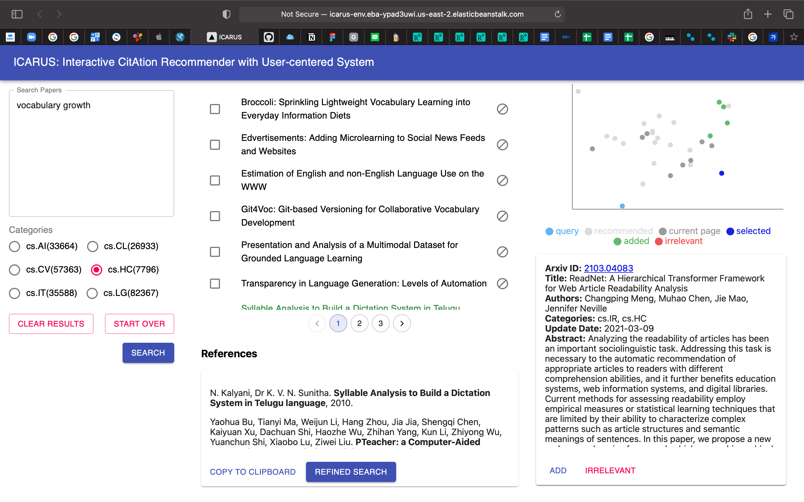

# ICARUS (Interactive CitAtion Recommendation with User-centered System)

*This project was done while taking a CS492E course (Human-AI Interaction) at KAIST.*

### Project Demo

- <https://youtu.be/oPSjkUIt2ww>

### Project Summary

With a substantial number of papers released every year, researchers are having a difficult time trying to find papers related to their own writing. We propose ICARUS (Interactive CitAtion Recommendation with User-centered System), which recommends academic papers that may be helpful for researchers to refer to and perhaps cite them in their own paper. The unique approach of ICARUS is that users can interactively explore semantically similar papers via 2D projection and refine the recommendations based on their own taste.

### Libraries and Frameworks

- Frontend

  - [React](https://reactjs.org/)
  - [Next.js](https://nextjs.org/)
  - [MobX](https://mobx.js.org/README.html)
  - [Material-UI](https://material-ui.com/)
  - [Recharts](https://recharts.org/)

- Backend
  - [Flask](https://flask.palletsprojects.com/en/2.0.x/)
  - [Scikit-Learn](https://scikit-learn.org/stable/)
  - [PyTorch](https://pytorch.org/)
  - [Huggingface Transformers](https://huggingface.co/)

### Project Structure

The project structure is as follows:

- __web/__ : contains all of frontend files
  - _components/_ : contains all React components
    - CategorySelection.tsx : a radio group component for selecting paper categories
    - Citation.tsx : an interactive container for storing citations of all added papers
    - Input.tsx : an input box for the user query
    - InteractiveChart.js : an interactive scatterplot displaying query and recommended papers
    - PaperDetail.tsx : an interactive container for storing metadata of the selected paper
    - PaperList.tsx : an interactive recommendation list
  - _pages/_ : contains all webpages
    - index.tsx : the first and main page
  - _stores/_ : contains and maintains states used in the React application
    - PaperStore.tsx : states regarding papers
    - UIStore.tsx : states regarding the general UI

- __api/__ : contains all of backend logic
  - _recommend.py_
    - __extract_topk_papers()__ : Given a query from the user input and the user-selected K, it embeds the query using [Sentence-BERT (Reimers et al.)](https://arxiv.org/abs/1908.10084) and compute cosine similarities against paper embeddings from the [arXiv dataset](https://www.kaggle.com/Cornell-University/arxiv). Then, it outputs top K most similar papers for recommendation.
    - __extract_topk_papers_with_added_vectors()__ : Given vectors, it computes the average of the vectors to create a new query and compute cosine similarities against other paper embeddings. Then, it outputs top K most similar papers for recommendation.

- __app&#46;py__ : declares all implemented APIs and runs the Flask application.
