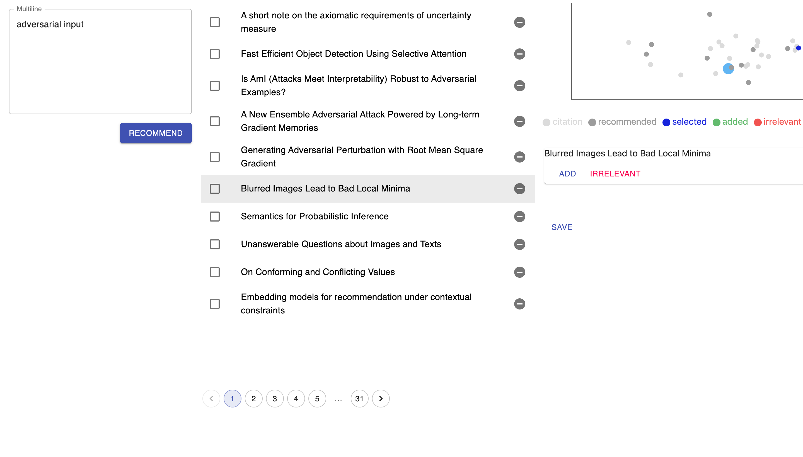
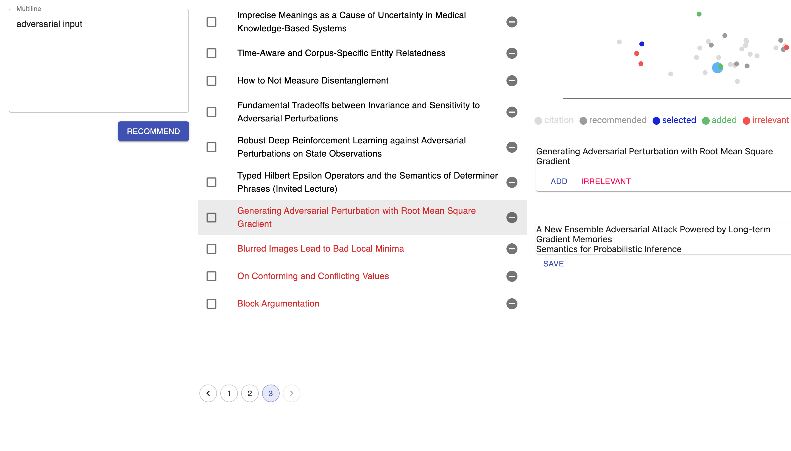

# Prototype Report

## Project Summary

With a substantial number of papers released every year, researchers are having a difficult time trying to find papers related to their own writing.
We propose ICARUS (Interactive CitAtion Recommendation with User-centered System), which recommends academic papers that may be helpful for researchers to refer to and perhaps cite them in their own paper.
The unique approach of ICARUS is that users can interactively explore semantically similar papers via 2D projection and refine the recommendations based on their own taste.

## Instruction

1. Users type in the sentence that they need papers for recommendation in the left text box
2. Based on the query sentence, ICARUS recommends papers to read based on Tf-Idf and Sentence BERT.

3. While displaying the papers, ICARUS also shows the 2D projection of the papers on the right.

4. Users can explore the papers while checking the relationships among them. The details for the paper are shown on the right, and the user can explore the same data from both the recommendation list and the 2D projection graph. The large dot is the input vector.

5. The papers are divided into pages, and the current page is highlighted in the graph as well. Going to later pages automatically fetches more recommendations.
   
6. Users can also add papers to cite, and it will show up on the list in the bottom right and appear colored on the graph and list. This will also refine the recommendation results in the later iterations.
   
7. Users can mark papers as irrelevant, which puts the marked paper at the end of the recommendation list.
   

## Prototype URL

- <http://icarus-env.eba-ypad3uwi.us-east-2.elasticbeanstalk.com/>

## Git Repository URL

- <https://github.com/brightjade/CS492E-CiteRec>

## Libraries and Frameworks

- Frontend

  - [React](https://reactjs.org/)
  - [Next.js](https://nextjs.org/)
  - [MobX](https://mobx.js.org/README.html)
  - [Material-UI](https://material-ui.com/)
  - [Recharts](https://recharts.org/)

- Backend
  - [Flask](https://flask.palletsprojects.com/en/2.0.x/)
  - [Scikit-Learn](https://scikit-learn.org/stable/)
  - [PyTorch](https://pytorch.org/)
  - [Huggingface Transformers](https://huggingface.co/)

## Individual Reflections

### Seokhun Jeong

> I mainly worked on the front-end of ICARUS. I used React for the front-end, and Nextjs to bootstrap the project. I designed and implemented the input box and paper list. The front-end needed complex state management, as there were many shared states such as the paper list and selection, plus various UI states.
> For this, I integrated MobX as a state-management tool and also used TypeScript to help with auto-completion of store methods.
> After Minsuk implemented the graph, I connected the data of the paper list and the graph, making selections on the paper list highlight the corresponding dots on the graph and vice versa.
> Then I implemented the key interactions of our project, including adding papers to cite, marking papers as irrelevant, and populating recommended papers by clicking next page.

> This was my first extensive use of state management (which was much needed in our project). I had used Redux once but didn’t enjoy using it that much; on the other hand Mobx was so much easier to use once set up properly. The shared state management helped me get my mind off state management and view updates.
> It was also my first time drawing charts in React, and Minsuk helped me get the hang of it by providing a solid frame and I could customize some properties pretty easily.

> One of the difficulties were understanding the collected data. After getting the top-K neighbors of the query vector, we embedded the vectors into 2D space. However, this caused a larger loss of information that anticipated, so that the resulting 2D embedding didn’t clearly represent which nodes were actually close together. While we initially intended to provide the data of the nearest neighbors upon selection of a data point, we found that this might just add confusion, as the nearest neighbors aren’t close together in the 2D plot. We are still thinking about ways to improve the 2D embedding. How to interpret the 2D embedding and explain this to the users remain a challenge to the project.

> Another was the explainability of our interactions. The first iteration had the buttons ‘add’ and ‘blacklist’, but I felt like these buttons didn’t explain the interaction very well. So, I changed the button ‘blacklist’ to ‘irrelevant’ and added tooltips that appear when users hover on the buttons for more than 700ms to explain the interactions in more depth: “Add to citation list: The recommendation list will be updated to better fit you preference“ and “Mark as irrelevant: This paper will show up last on your recommendation list”.

---

### Jungsoo Lee

> I developed the back-end of ICARUS. To be more specific, I was responsible for using Tf-IDF and pretrained Sentence BERT. I also extracted the x,y coordinates used for 2D projection. One of the difficulties I faced was extracting the x,y coordinates from the features of the abstracts. I first used T-SNE but it was extremely slow. Thus, I changed the algorithm to PCA which enabled our team to extract the coordinates in real time. In this regard, I learned that PCA is more useful compared to TSNE when projecting data items in real time. I also learned how to use hugging face libraries which I didn't use because NLP is not one of my research interest.

---

### Minseok Choi

> Since I have experiences with both React and Flask, I was mainly responsible for combining React components and Flask API. I also dockerized the project and deployed it on AWS. The hardest challenge was deploying our machine learning application. The amount of space that the installed machine learning libraries and packages take and the amount of computation power that the application requires troubled me to configure server and proxy settings, such as allocating an additional space, increasing the connection timeout, and upgrading the AWS instances. With the struggles overcome, I got much more comfortable with developing both ends of the application and deploying it on the web. Deploying a machine learning application can now be done with ease.
